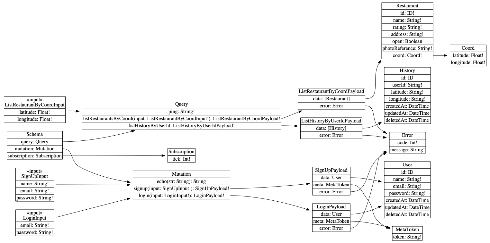

# Gateway-API

Gateway agregation layer implemented in Express server with GraphQL.

## Schema

[](./docs/images/schema.png)

## Schema

### Models

```graphql
type User {
  "The user ID"
  id: ID

  "The name of a user"
  name: String!

  "The email of a user"
  email: String!

  "The password of a user"
  password: String!

  "The date and time at which this user was created"
  createdAt: DateTime

  "The date and time at which this user was last updated"
  updatedAt: DateTime

  "The date and time at which this user was deleted"
  deletedAt: DateTime
}
```

```graphql
type Restaurant {
  "The restaurant ID"
  id: ID!

  "The name of a restaurant"
  name: String!

  "The rating of a restaurant"
  rating: String!

  "The address of a restaurant"
  address: String!

  "Indicates if restaurant is open"
  open: Boolean

  "The photoReference of a restaurant"
  photoReference: String!

  "The coordinate of a restaurant"
  coord: Coord!
}
```

```graphql
type Coord {
  "The coordinate latitude"
  latitude: String!

  "The coordinate longitude"
  longitude: String!
}
```

```graphql
type History {
  "The history ID"
  id: ID!

  "The user id of a history"
  userId: String!

  "The coordinate latitude"
  latitude: String!

  "The coordinate longitude"
  longitude: String!

  "The date and time at which this history was created"
  createdAt: DateTime

  "The date and time at which this history was last updated"
  updatedAt: DateTime

  "The date and time at which this history was deleted"
  deletedAt: DateTime
}
```

### Query

```graphql
listRestaurantsByCoord(input: ListRestaurantByCoordInput!): ListRestaurantByCoordPayload!
```

```graphql
listHistoryByUserId(input: ListHistoryByUserIdInput!): ListHistoryByUserIdPayload!
```

### Mutations

```graphql
signup(input: SignUpInput!): SignUpPayload!
```

```graphql
login(input: LoginInput!): LoginPayload!
```

### GraphiQL

`http://localhost:5000/graphql`: for open browser IDE for exploring GraphQL.

## Commands (Development)

`make prepare`: prepare repository.

`make typescript`: Transpile typescript dependencies.

`make docker`: build docker.

`make r`: run tenpo gateway service.

## TODO

- [ ] implements listHistoryByUserId endpoint.
